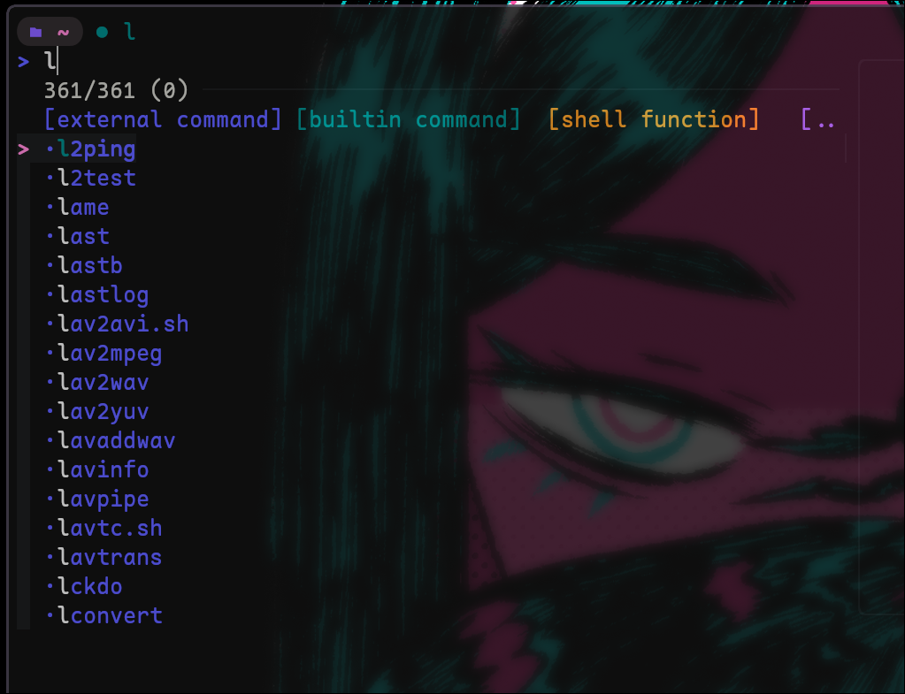
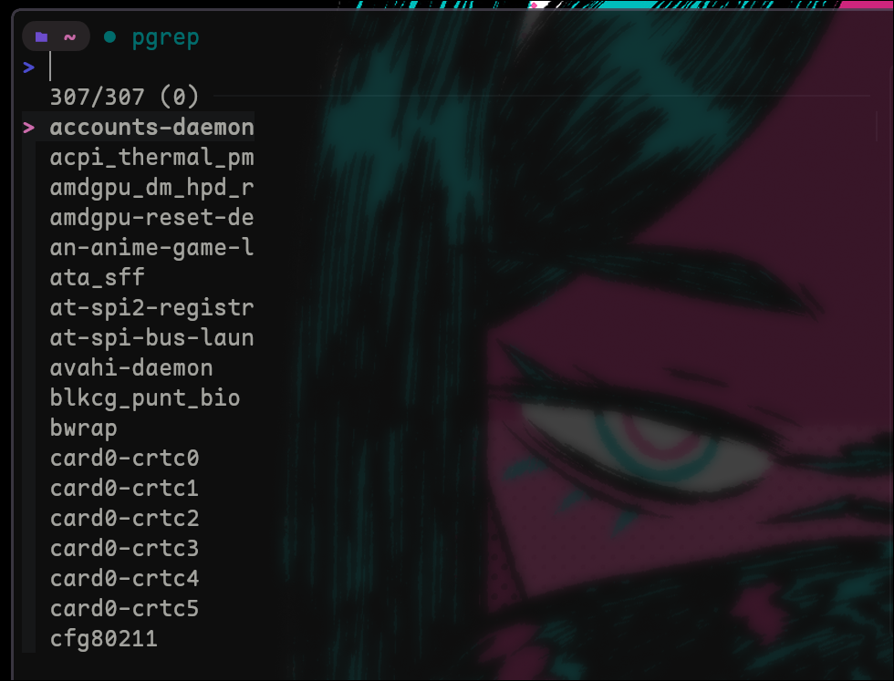
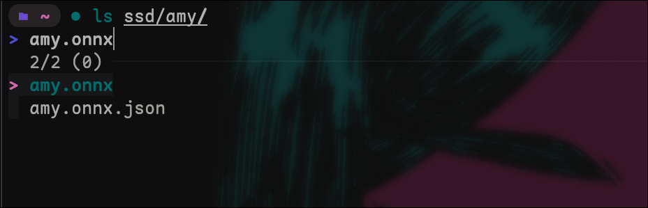
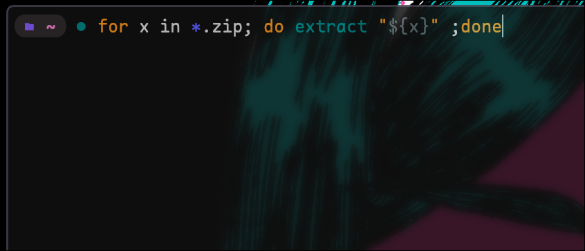
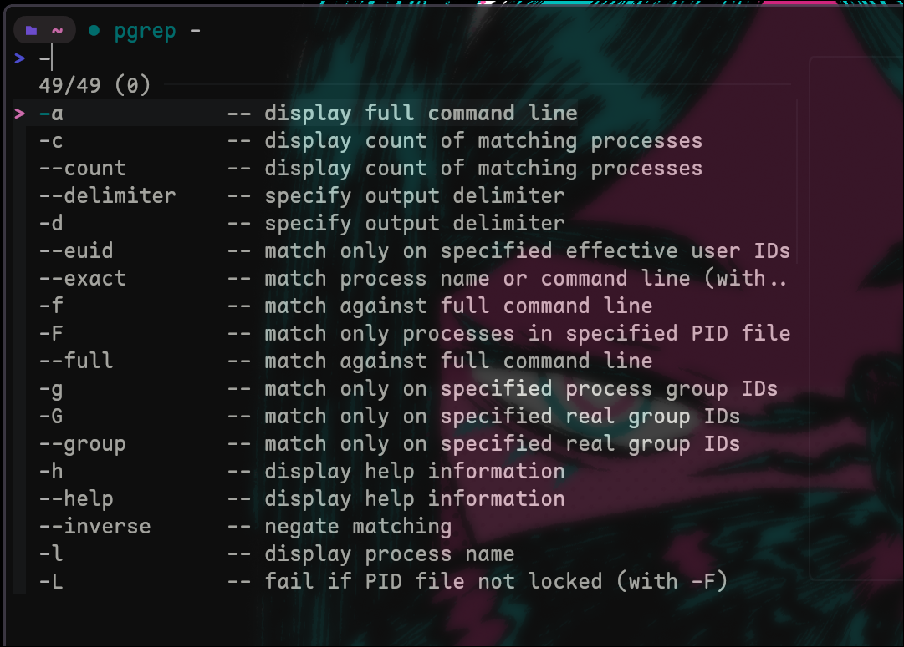
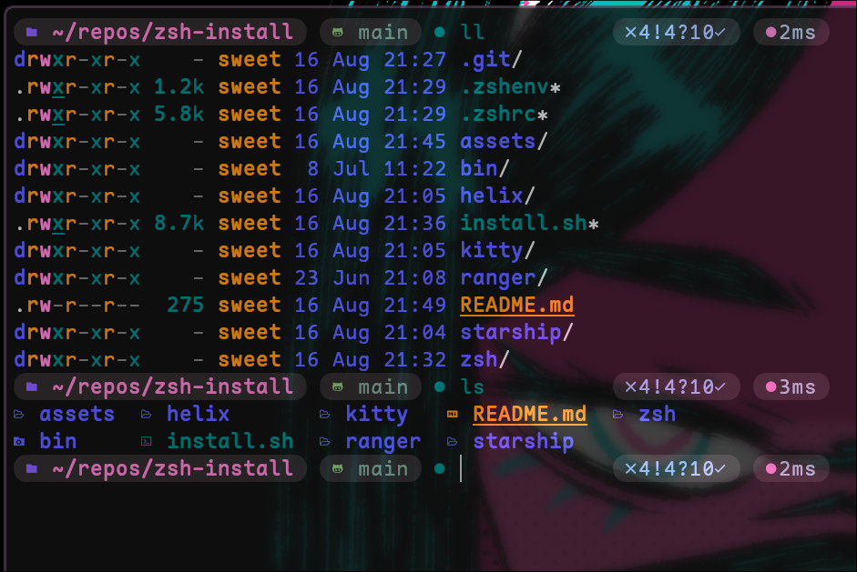

# Sweet's terminal necessities

## Features

- Smart tab completion using fzf and sane defaults.
  you can auto-complete a binary name by typing a starting letter and hitting TAB.
  You'll get a fzf list that contains all shell functions and binaries in your path. Very
  useful for remembering obscure script names and functions.

  you can also use this tab completion to auto complete directory names ie (ls ~/_tab/\*\*tab_)
  and it will automatically let you see and interact with the lower directories. its equivalent
  to constantly doing (ls ; cd directory ; ls ; cd ) but insanely faster

  you can also auto complete command flags. (pgrep - **tab**) and it will show you the options you have.
  no more guessing.

  Variable expansion. You can run (ls $**tab**) to see a list of ALL environment variables that are set.
  Its very useful.

- Smart Auto-suggestions based on history (ghost text) press left or right arrow to complete/insert the text into the commandline
  (inputting w and hitting the UP arrow will match all commands in history that start with a W first)

- Auto cd - just type a directory name to cd into it.
- Ctrl + backspace -delete the entire word
- Ctrl+left/right to jump one word left or right
- Ctrl+r to reverse history search using FZF

### Starship config

## Examples

