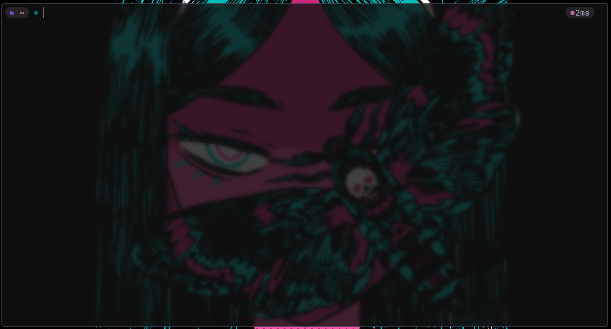

# Sweet's terminal necessities

## Features

- Smart tab completion using fzf and sane defaults.
  you can auto-complete a binary name by typing a starting letter and hitting TAB.
  You'll get a fzf list that contains all shell functions and binaries in your path. Very
  useful for remembering obscure script names and functions.

  you can also use this tab completion to auto complete directory names ie (ls ~/_tab/\*\*tab_)
  and it will automatically let you see and interact with the lower directories. its equivalent
  to constantly doing (ls ; cd directory ; ls ; cd ) but insanely faster

  you can also auto complete command flags. (pgrep - **tab**) and it will show you the options you have.
  no more guessing.

  Variable expansion. You can run (ls $**tab**) to see a list of ALL environment variables that are set.
  Its very useful.

- Smart Auto-suggestions based on history (ghost text) press left or right arrow to complete/insert the text into the commandline
  (inputting w and hitting the UP arrow will match all commands in history that start with a W first)

- ZSH syntax highlighting. Great to know if you made a small mistake while using one-liners on the command line.

- Auto cd - just type a directory name to cd into it.
- Ctrl + backspace -delete the entire word
- Ctrl+left/right to jump one word left or right
- Ctrl+r to reverse history search using FZF

### Starship config

Cofiguration for "prompt" using Starship

## Examples

Auto search your path for binaries, executables, funcions and shell-builtins.

_smart_ auto completion for most commands that provide completion scripts. In this example
with pgrep, auto completion shows running processes. "ls" will show directories etc...

note that only _valid_ directories are underlined - helpful to know if what you are working on actually exists

Syntax highlighting for small one-liners on the command line. Any errors will be highlighted.

Command flag completion!

auto-suggestions based on history. It will match the letters you have already typed first.
typing "w" and hitting the UP or DOWN arrow will match all commands in history that start with that letter

Hit CTRL+R for a more comprehensive fzf list of your zsh history!

colored output using exa. Makes it far easier to see what you are working with. eza is also a good option.
